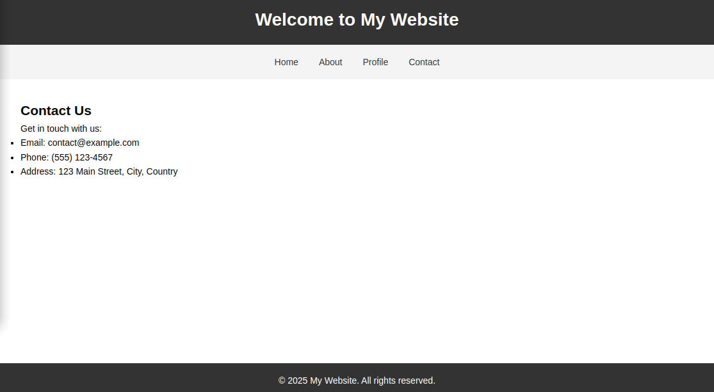
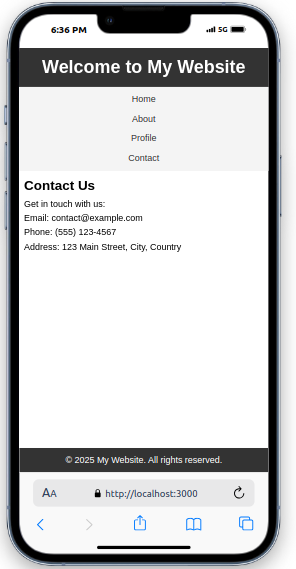

# <a href="https://github.com/DavitTec/nodeit"></a>


<a href="https://davit.ie/"></a>


<a href="https://twitter.com/intent/follow?screen_name=_davit">
        </a>


playing with node

# Simple Website Tutorial Starter kit



## Prerequisites

Update your repositories
``` 
sudo apt-get update
```
install nodejs
``` 
sudo apt install nodejs
```

install pnpm
  -  optionally to include other modules if you wish

``` 
 sudo apt install pnpm 
```

Move to or create a project folder for running this application.
The Git clone will create a new folder called **node.it**.

## Installing app

Git clone

``` 
git clone https://github.com/DavitTec/node.it.git  && cd node.it
```

Testing it!

``` 
npm install  
```
Now run a simple Hello World http server
``` 
pnpm hello

```
After running the app from your terminal, access your browser and open 
[http://localhost:3000/](http://localhost:3000/)

## Test

First do a test

```bash
pnpm test
```

This will present information to Console only

## Run Web

```bash
pnpm web
```

This will run **'node ./src/bin/www'** and the Express server


