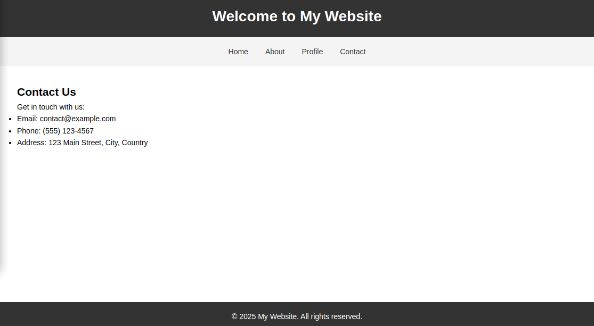
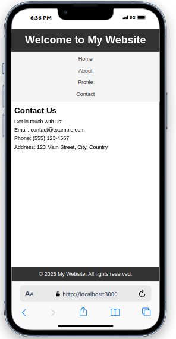

# <a href="https://github.com/DavitTec/nodeit"></a>


<a href="https://davit.ie/"></a>


<a href="https://twitter.com/intent/follow?screen_name=_davit">
        </a>


playing with node

# Simple Website Tutorial Starter kit



## Prerequisites

Update your repositories
``` 
sudo apt-get update
```
install nodejs
``` 
sudo apt install nodejs
```

install pnpm
  -  optionally to include other modules if you wish

``` 
 sudo apt install pnpm 
```

Move to or create a project folder for running this application.
The Git clone will create a new folder called **node.it**.

## Installing app

Git clone

``` 
git clone https://github.com/DavitTec/node.it.git  && cd node.it
```

Testing it!

``` 
pnpm install  
```
Now run a simple Hello World http server
``` 
pnpm hello

```
After running the app from your terminal, access your browser and open 
[http://localhost:3000/](http://localhost:3000/)

## Test

First do a test

```bash
pnpm test
```

This will present information to Console only

## Run Web

```bash
pnpm web
```

This will run **'node ./src/bin/server.js'** and the Express server



## Troubleshooting: finding and killing a running server/port

If a server is still running and Ctrl+C doesn't stop it — for example it was
started detached, in another terminal, or by a tool that isn't your current
shell's child process — find and stop it directly instead:

Find it:
```bash
ss -tlnp | grep :3000        # by port — shows the PID directly
pgrep -fa server.js          # by process name/command line
```

Stop it:
```bash
kill <PID>          # polite (SIGTERM) — gives it a chance to shut down cleanly
kill -9 <PID>        # forceful (SIGKILL) — use if the plain kill doesn't work after a few seconds
```

Swap `:3000` for whatever port you're running on (e.g. `8080`, or the `PORT`
set in `.env` for staging/production — see
[doc/Local_Network_Testing.md](doc/Local_Network_Testing.md)).
